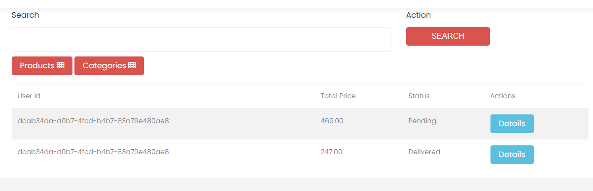
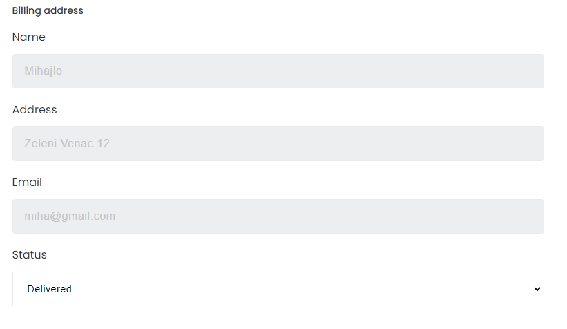
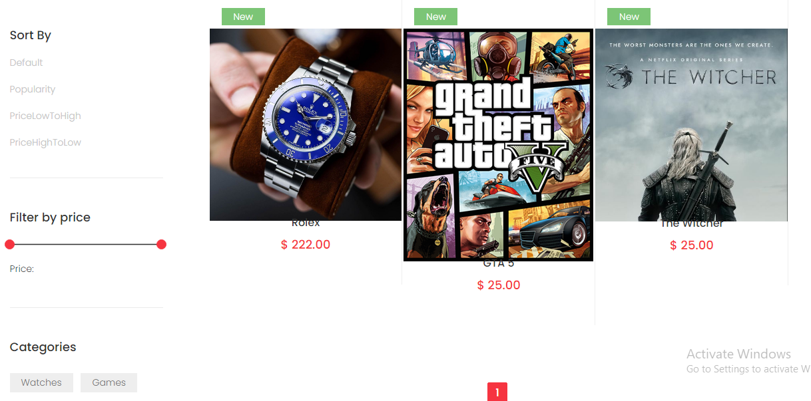

### ASP.NET MVC & jQuery Ajax eCommerce application

#### jQuery
- Ajax Pagination for Admin Products, Categories and Shop page.
- Ajax Upload Images.
- Ajax Add (Serializing form), Edit, Delete, Search products, categories.
- Ajax Change Order status (Admin page).
- Ajax filter products per price, search, categories.
- Client Validations - jQuery rules, messages.
- Sweet Alert messages.
- Applying theme for Admin and Client UI.
- Shopping cart with cookies.
- LocalStorage data-id for dynamic parameters.
- Bootstrap Forms, Tables, Icons.
#### ASP .NET MVC
- Data Migration.
- Business Entities, DB Context.
- Services.
- EF queries, LINQ Joins.
- Entity State for CRUD.
- Entity Framework, Foreign Key - Constraints (table relationships).
- Singleton Design Pattern.
- Tables: AspNetUser, Orders, OrderItems, Products, Categories.
- Data Annotations for Entities, .NET validations, Error status.
- .NET Identity Authentication.
- Current Logged-in User Identity.
- View and PartialView for preventing duplicate HTML jQuery Ajax.

